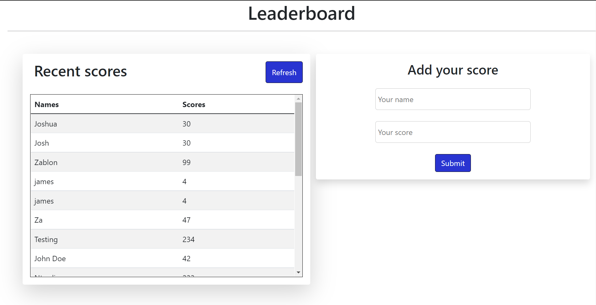

# LEADERBOARD SCORE

> The leaderboard website displays scores submitted by different players. It also allows you to submit your score. All data is preserved thanks to the external Leaderboard API service.



## Built With

- HTML, CSS , JAVASCRIPT, BOOSTRAP
- WEBPACK, LINTERS, GIT

## Live Demo

[Live Demo Link](https://ntwali-josue.github.io/leaderboard/)

## Get Started

To run this project on your local machine please follow these steps
 
 ### Prerequisites

For this project, the following environment should be previously installed on your machine:

- Node 14.17.0
- Git

### Setup

In your terminal, in the folder of your preference, type the following bash command to clone this repository:

```sh
git clone git@github.com:Ntwali-Josue/leaderboard.git
```
### Install

Now that you have already cloned the repo run the following commands to get the project up and running:
```sh
cd leaderboard
npm install
npm run build
npm start
```
### Executing

Now, you can start editing this template from the files provided in the `/src` folder. All the changes will be automatically updated on your local server on http://localhost:8080/. You can stop your local server at any time hitting `<Ctrl> + C` on your keyboard.

## Author

👤 **KARANGWA Ntwali Josue**

- GitHub: [@githubhandle](https://github.com/Ntwali-Josue)
- Twitter: [@twitterhandle](https://twitter.com/JosueNtwali)
- LinkedIn: [LinkedIn](https://linkedin.com/in/karangwa)

## 🤝 Contributing

Contributions, issues, and feature requests are welcome!

Feel free to check the [issues page](https://github.com/Ntwali-Josue/leaderboard/issues/).

## Show your support

Give a ⭐️ if you like this project!

## Acknowledgments

- Hat tip to anyone whose code was used
- Inspiration
- etc

## 📝 License

This project is [MIT](./MIT.md) licensed.
